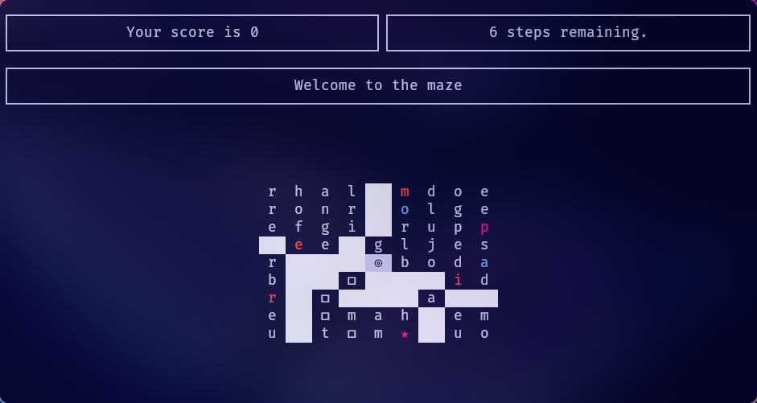
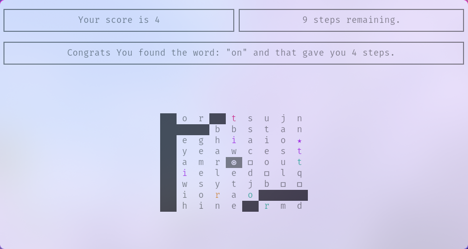

# word-blazer


[](https://github.com/mmed-hajnasr/word-blazer/releases)
[](https://github.com/mmed-hajnasr/word-blazer/commits/main)

## Game overview

a TUI Labyrinth game that takes advatage of multiple graph alguorithms.

> [!TIP]
>
> The game follows the font and colors of your terminal emulator.
>

|  |  |
| --------------------------------------- | ----------------------------------------- |

## How to play

Navigate the labyrinth to find the exit "★".

- Explore the maze systematically to discover the exit without running out of steps.
- Form words using the letters encountered within the maze to replenish your step count and add to your score.

## Installation

### Pre-compiled binary.

1. **Download the Binary:**

Head over to the project's releases on GitHub: [v0.1.0 release](https://github.com/mmed-hajnasr/word-blazer/releases/tag/v0.1.0). There, you'll find pre-built binaries for various operating systems. Download the binary that corresponds to your system.

2. **Extract and run the binary:**

```sh
 tar -xvzf [downloaded_file]
 ./word-blazer
```

### Manual installation

```sh
git clone git@github.com:mmed-hajnasr/word-blazer.git
cd word-blazer
cargo install --path .
```

## Possible future improvements

- [ ] more PowerUps.
- [ ] main menu.
- [ ] different modes.
